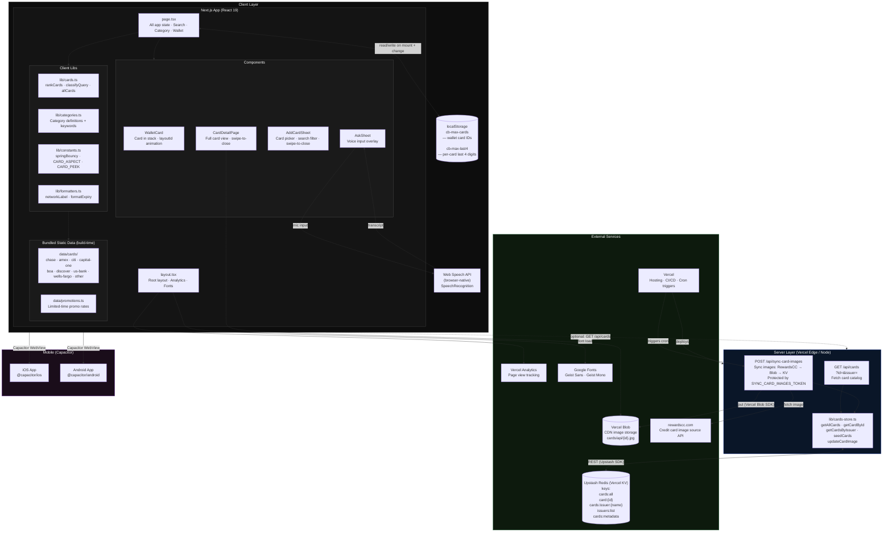

# CardSense — Application Architecture



---

## Data Stores

| Store | What lives there | Who writes | Who reads |
|---|---|---|---|
| **localStorage** `cb-max-cards` | User's wallet — array of card IDs | `page.tsx` on toggle | `page.tsx` on mount |
| **localStorage** `cb-max-last4` | Last-4 digits keyed by card ID | `page.tsx` on change | `page.tsx` on mount |
| **Upstash Redis (KV)** | Full card catalog: all cards, per-id, per-issuer, issuer list, metadata | `seed-kv` script + `sync-card-images` API | `/api/cards` route |
| **Vercel Blob** | Card artwork images (CDN-served) | `sync-card-images` API | Client `` tags in `CardDetailPage` / `AddCardSheet` |
| **Bundled JSON** (`src/data/cards/`) | Static card data compiled into the app bundle | Committed to git | `lib/cards.ts` at runtime (no network call) |

## Services

| Service | Role |
|---|---|
| **Vercel** | Hosting, CI/CD, cron job triggers |
| **Vercel Analytics** | Page-view and interaction telemetry |
| **Vercel KV (Upstash Redis)** | Server-side card catalog store |
| **Vercel Blob** | CDN image storage for card artwork |
| **rewardscc.com API** | Source of card artwork images (synced periodically) |
| **Google Fonts** | Geist Sans + Geist Mono typefaces |
| **Web Speech API** | Browser-native mic input for voice search |
| **Capacitor** | Wraps the web app for iOS / Android distribution |

## Key Data Flows

1. **App boot** → reads `localStorage` to restore wallet → renders card stack from bundled JSON
2. **Voice search** → Web Speech API → transcript → `classifyQuery()` → re-ranks wallet cards
3. **Add card** → toggles ID in `myCardIds` → persisted to `localStorage`
4. **Image sync (cron/manual)** → `POST /api/sync-card-images` → rewardscc.com → Vercel Blob → Upstash KV
5. **Card catalog API** → `GET /api/cards` → Upstash KV → JSON response *(currently the client uses bundled data, not this endpoint)*
```
